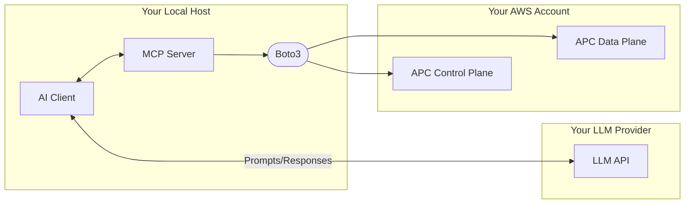

# AWS Payment Cryptography MCP Server

[](https://github.com/J8k3/aws-payment-cryptography-mcp/actions/workflows/ci.yml)
[](https://github.com/J8k3/aws-payment-cryptography-mcp/actions/workflows/release.yml)
[](https://github.com/J8k3/aws-payment-cryptography-mcp/releases)
[](https://www.python.org/downloads/)
[](LICENSE)

An MCP server for [AWS Payment Cryptography (APC)](https://docs.aws.amazon.com/payment-cryptography/latest/userguide/what-is.html). Gives AI coding assistants direct access to the APC control plane (key lifecycle) and data plane (cryptographic operations), along with embedded knowledge of payment standards, HSM vendor command sets, and PCI PIN v3.1 compliance requirements. This tool is for development and testing purposes only and should not be used directly within a production system. It is designed to accelerate the 'Proof of Concept' phase and migration analysis by providing a domain-aware interface for AWS Payment Cryptography. Works with Claude Code, Codex CLI, and any MCP-compatible client.

There are three reasons to use this:

1. **You're building a new acquirer or processor integration on APC** and want an AI co-pilot that understands the domain — key hierarchies, DUKPT, TR-31/TR-34, PIN formats, compliance constraints — without reading documentation for every API call.

2. **You have existing code that runs against a Thales payShield 10K or Futurex Excrypt Enterprise SSP v.2** and want to understand what it's doing before migrating to APC.

3. **You're using [apc-hsm-proxy](https://github.com/J8k3/aws-payment-cryptography-hsm-proxy) to move an application to APC without refactoring it**, and need to build handlers for the specific commands your application sends.

Issuer functions — card personalization, IMK/CMK derivation, issuer script processing — are out of scope. A small number of issuer-adjacent APC operations (PIN generation schemes, EMV secure messaging) are exposed for completeness but are not the focus. This is a template, not a production system.

---

## Architecture & Trust Boundaries


---

## Setup

```bash
pip install -e .
apc-agent        # starts the MCP server over stdio
```

**The MCP server is client-agnostic** — it speaks the standard Model Context Protocol over stdio and works with any MCP-compatible client. `CLAUDE.md` and `.claude/` are Claude Code convenience files; `.codex/` is the Codex CLI equivalent. Neither is required to run the server itself.

**Claude Code** — `.claude/settings.json` in this repo registers the server automatically. For Claude Desktop, add the same block to `~/Library/Application Support/Claude/claude_desktop_config.json` (macOS) or `%APPDATA%\Claude\claude_desktop_config.json` (Windows):

```json
{
  "mcpServers": {
    "apc-agent": {
      "command": "apc-agent",
      "env": { "AWS_REGION": "us-east-1" }
    }
  }
}
```

**Codex CLI** — `.codex/config.toml` in this repo registers the server automatically. For user-level registration (applies across all projects), add the same block to `~/.codex/config.toml`:

```toml
[mcp_servers.apc-agent]
command = "apc-agent"
env = { AWS_REGION = "us-east-1" }
```

Or register via the CLI:

```bash
codex mcp add apc-agent --env AWS_REGION=us-east-1 -- apc-agent
```

**Kiro** — [](https://kiro.dev/launch/mcp/add?name=apc-agent&config=%7B%22command%22%3A%22apc-agent%22%2C%22env%22%3A%7B%22AWS_REGION%22%3A%22us-east-1%22%7D%7D)

AWS credentials are consumed via the standard boto3 chain: IAM role, `~/.aws/credentials`, or environment variables. Set `AWS_REGION` to the region where your APC resources live.

---

## Workflow 1 — Building a new integration

**Who it's for:** Payment engineers and solutions architects building a new acquirer or processor system on AWS, starting from scratch or greenfield on APC.

**What you do:** Describe your architecture in plain language. The AI calls APC directly, explains every decision, and checks compliance before making any API call. You get working code and a key hierarchy — not just documentation references.

**How it works:**

1. Install the MCP server and connect it to your AI client (Claude Code, Codex CLI, etc.).
2. Describe what you're building. Example: *"I need AES DUKPT for a fleet of POS terminals. PIN blocks should go to ISO Format 4, translated over a ZPK to my network processor, with CMAC on ISO 8583 field 64."*
3. The AI creates the keys in APC, explains the hierarchy, writes the integration code, and flags any compliance issues before calling any API.

The default for a new acquirer integration:

```
Terminal / POI
  └── AES DUKPT (BDK in APC, KSN per transaction)
        └── ISO Format 4 PIN block → translate_pin_data
              └── ZPK (AES P0) → host-to-host PIN routing
                    └── CMAC (AES M6) on ISO 8583 field 64

Key Exchange with Network / Processor
  └── TR-34 (asymmetric KEK establishment)
        └── TR-31 / X9.143 for all subsequent symmetric key transport

Card Data Protection
  └── AES (D0) or FF1 FPE for format-preserving tokenization
```

Deviating from this path — TDES, Format 0 PIN blocks, TDES DUKPT, CBC-MAC — requires explicit confirmation. The agent explains why the modern approach is preferred, asks whether you've confirmed the downstream system doesn't support it, then helps implement the legacy path correctly with a documented code comment and a notice that a QSA exception may be required.

**Compliance enforcement** is built into the tool layer and is not configurable off. Hard stops enforced in code: illegal PIN format translation pairs (PCI PIN Req 3-3), AES keys with non-CMAC KCV (PCI PIN Annex C), unknown TR-31 key usage codes. Legacy construct warnings (Format 0, CBC-MAC, retail MAC) require explicit confirmation before proceeding. PAN identity during PIN translation and algorithm-level prohibitions (single DES, RSA < 2048) are enforced by APC at the API level — calls with prohibited parameters are rejected by the service.

---

## Workflow 2 — Migrating existing HSM code

**Who it's for:** Developers migrating an application that currently sends commands to a Thales payShield 10K or Futurex Excrypt Enterprise SSP v.2, who need to understand what the code is doing before writing the APC replacement.

**What you do:** Show the AI your existing source code. It identifies every HSM operation in use, maps each one to the equivalent APC call with the correct key type, and flags anything with no direct equivalent or that requires architectural changes.

**How it works:**

1. Connect the MCP server to your AI client and open the relevant source files.
2. Ask it to analyze them. Example: *"What HSM operations does this code use and what are the APC equivalents?"*
3. The AI calls `hsm_analyze_code`, which scans for Futurex Excrypt bracket-delimited commands (`[TPIN;...]`) and Thales two-char command codes (`CA`, `G0`, `M6`, etc.) in the source, then looks each one up in the command registry.
4. For each command detected: the APC operation to call, the required key type (TR-31 usage code), a confidence level, and migration notes.
5. The AI writes the refactored code using the APC SDK and validates it against the compliance rules.

**LMK key migration:** Keys stored as LMK-encrypted blobs in your application or database can't be imported into APC directly. They must be exported from the source HSM in TR-31 or TR-34 format first. The server surfaces this when it detects LMK references and guides the import process using `get_parameters_for_import` and `import_key`.

**Coverage:** Futurex Excrypt Enterprise SSP v.2 / Standard API (authoritative — Futurex General Payment HSM Integration Guide 2024), Thales payShield 10K (authoritative — Thales payShield 10K Legacy Host Commands manual), Atalla/HPE/NCR (directory quality — command names and APC mappings only, no parameter detail; proxy support not implemented).

---

## Workflow 3 — Building proxy handlers

**Who it's for:** Teams using [apc-hsm-proxy](https://github.com/J8k3/aws-payment-cryptography-hsm-proxy) — where the application is a black box, third-party, or can't be refactored, so a protocol translation layer handles the HSM-to-APC conversion instead.

**What you do:** Run the proxy in discovery mode to observe what commands your application actually sends, then use this server to build handlers for those specific commands.

**How it works:**

1. Configure apc-hsm-proxy with `discover.enabled: true`, `hsm_host` pointing at your real HSM, and `log_file: discovery.jsonl`. Start the proxy between your application and the real HSM. The proxy forwards unhandled commands to the real HSM while writing one JSON record per unique command code to `discovery.jsonl` — command code, vendor, and parameter names (key blocks and PIN blocks are redacted).

2. Run your application through a representative set of transactions. Stop the proxy. Open `discovery.jsonl` — it will have one entry per distinct command your application sent.

3. In an AI coding session with the MCP server connected, read `discovery.jsonl` and call `hsm_analyze_discovery_log` with its contents. The tool returns: which commands already have proxy handlers, which need to be built, the APC operation and key type for each, and the exact file path and handler structure to implement for each one.

4. The AI writes the Rust handler for each command modeled on the existing handlers in the proxy's `src/handlers/<vendor>/` directory. You add the file, register it in `mod.rs`, and rebuild the proxy.

5. Disable discovery mode (`discover.enabled: false`) and test with the real application. The proxy now routes the handled commands to APC and returns error 68 for anything unrecognized.

The discovery log is the handoff between the two tools. Because it deduplicates — writing once per command code, not once per transaction — it stays small and works directly as source context in an AI coding session.

---

## Testing

```bash
pip install pytest pytest-asyncio "moto[payment-cryptography]"
python -m pytest
```

---

## Project Structure

```
src/apc_agent/
├── server.py          — FastMCP entry point; registers all tool groups and the KB resource
├── control_plane.py   — Key lifecycle tools (payment-cryptography client)
├── data_plane.py      — Cryptographic operation tools (payment-cryptography-data client)
├── hsm_tools.py       — HSM analysis and discovery log MCP tools
├── hsm_analysis.py    — HSM command registry and regex patterns
├── system_prompt.py   — Domain knowledge injected as MCP instructions
└── compliance.py      — PCI guard-rail logic: hard stops, warnings, key usage registry

payment-knowledge-base.md                    — MCP resource: payment://knowledge-base
aws-payment-cryptography-data-plane-use-cases.json  — APC data plane capability catalog (source of truth for tool implementation)
```

The knowledge base is exposed as an MCP resource at `payment://knowledge-base`. It covers card data, PIN blocks, card verification values, EMV tags, ISO 8583 fields, key types, HSM commands, cryptographic algorithms, and constraint rules. The agent reads it on demand; it is not injected into the system prompt. Add new entries to `payment-knowledge-base.md` and update the Sources table at the bottom — no server restart required.

---

## Testimonial

While working on [CyberChef Payments](https://github.com/J8k3/CyberChef): 

Me: "tell me, did the apc-agent mcp server help at all in the work you completed"

Kiro: "Yes, genuinely — and in specific ways that reading the code alone wouldn't have caught. It acted as a fast, authoritative reference for the parts of the payment domain that are hard to verify from code alone — key type constraints, PCI requirement numbers, and the AES DUKPT migration boundary. Worth having for that kind of domain-grounding work."

---

## Security & Privacy

**Production Data:** Never use this tool with production cryptographic keys, real Primary Account Numbers (PANs), or live PIN blocks.

**Data Handling:** This tool interfaces with Large Language Models (LLMs). Any data provided in a prompt—including key metadata, command logs, or test identifiers—may be sent to the LLM provider. Ensure all data used with this server is strictly for development or synthetic testing.

**Credential Safety:** The server uses the standard boto3 credential chain. Ensure your environment is configured with the least-privilege IAM permissions required for payment-cryptography actions.

**No Plaintext Keys:** This tool does not support and will never prompt for plaintext key material (Clear Components). All key operations must be performed using encrypted tokens or service-managed keys within AWS Payment Cryptography.

---

## Development Note

This project was built with AI-assisted development. AI was used to accelerate implementation, testing, documentation, and research synthesis. Architecture, scope, source selection, review, and final publish decisions were made by the author.

Because this project touches payment-cryptography topics, claims in the code and documentation were reviewed against authoritative vendor and AWS documentation where possible. Remaining limitations and uncertainty are called out explicitly.

---

## Authoritative References

All APC API behavior in this codebase is derived from these sources.

- [APC User Guide](https://docs.aws.amazon.com/payment-cryptography/latest/userguide/what-is.html)
- [Control Plane API Reference](https://docs.aws.amazon.com/payment-cryptography/latest/APIReference/Welcome.html)
- [Data Plane API Reference](https://docs.aws.amazon.com/payment-cryptography/latest/DataAPIReference/Welcome.html)
